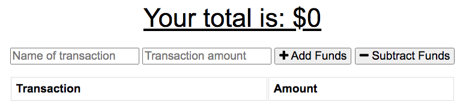

# Budget Tracker Application

## Description
The goal of this project was to create a budget tracker application that allows for offline access and functionality. A user can enter deposits and expenses offline and they will be added to the tracker once it is brought back online.

## Installation
Visit this link to view the app: https://tracker-budget-2021.herokuapp.com/ 

## Screenshots
Budget Tracker Layout:

## License

[MIT](./public/images/license.txt)

